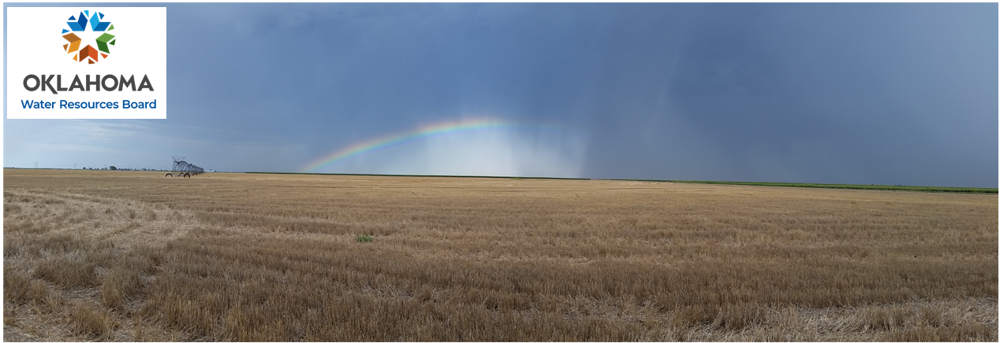
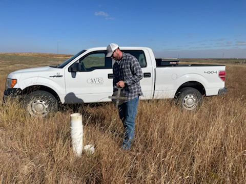
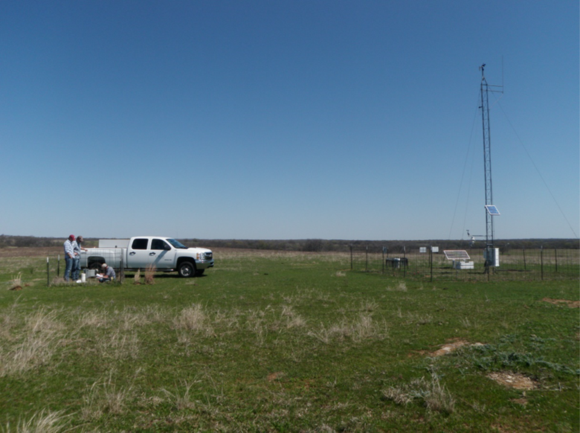

<!---
This is an R shiny application built into a RMD document, written by Zachary Tomlinson at the OWRB. The primary purpose is to allow people to find OWRB and USGS continuous water level recorders in their area by a number of search parameters (county, aquifer, etc.) and then display continuous water level measurements for those sites. Supplemental data (gwlevels.rds) and images are included and should be in the same directory as this file. If you have any questions or comments, contact:

Zachary Tomlinson

Environmental Specialist, OWRB

Zachary.Tomlinson@owrb.ok.gov

DISCLAIMER: This code is for display and peer-review purposes ONLY and should not be used for obtaining OWRB or USGS water level data for analytic uses

-->


```{r setup, include=FALSE}
knitr::opts_chunk$set(echo = FALSE, message = FALSE, warning = FALSE,error = FALSE)
```

```{r}

```

# {.tabset}

## About the program
The OWRB gathers water level data across the State of Oklahoma every year. For a large proportion of those sites, ORWB staff drive out and take discrete depth to water measurements, which are later used for groundwater level trend analysis (shown below).

```{r}

```

The OWRB also maintains a number of recorder sites (like the one shown below) which collect groundwater level data continuously every hour. The USGS also maintains a number of recorder sites throughout the state. Continuous water levels from the two agencies make up the data used for the included hydrograph explorer. These types of sites are important because they can indicate seasonal trends in groundwater levels in addition to identifying larger risks of aquifer depletion. 

```{r}

```

## Hydrograph data explorer

Welcome to the hydrograph data explorer. This application pulls continuous groundwater level data from all USGS National Water Information Systems (NWIS) sites and Oklahoma Water Resources Board (OWRB) sites. To begin, select an option from one or more of the search parameters below. This will pull up a list of sites that meet your search parameters along with a map of the site locations. To further filter site results, you can click individual points on the map, draw polygons over the sites of interest, or select additional search parameters. Once you are done filtering, select sites from the "Choose sites to graph" list to graph the available data on a hydrograph. Once data has been selected for the hydrograph, it can be downloaded as a csv file with the download button. 


To refresh your search options, click the "Reset inputs" button below. 


**NOTE:** Downloaded data returns latitudes and longitudes rounded to three decimal places to protect landowner privacy. 


```{r}
#
# This is the main r shiny application
library(shinyWidgets)
library(lubridate)
library(dygraphs)
library(xts)
library(tidyverse)
library(leaflet)
library(leaflet.extras)
library(sp)
#library(geoshaper)
library(dplyr)
library(data.table)

gwlevel2 = as.data.frame(readRDS("gwlevels.rds"))
gwlevel2$site_no = as.character(gwlevel2$site_no)

ui <- fluidPage(fluidRow( # Prompt user to enter local aquifer
    column(4, multiInput(
        inputId = "lc_aqfr", label = "Local aquifers",
        choices = unique(gwlevel2$aqfr_nm), width = "400px",
        options = list(
            enable_search = TRUE,
            non_selected_header = "Possible Sites:",
            selected_header = "You have selected:"
        )
    )),
   
    column(4, multiInput( # Prompt user to enter national aquifer from NWIS Oklahoma list
        inputId = "ntnl_aqfr", label = "National Aquifers",
        choices = unique(gwlevel2$nat_aqfr_nm), width = "400px",
        options = list(
            enable_search = TRUE,
            non_selected_header = "Possible Sites:",
            selected_header = "You have selected:"
        )
    )),
    column(4,
           multiInput( # Prompt user to enter county (in Oklahoma)
            inputId = "County", label = "County",
            choices = unique(gwlevel2$county_nm), width = "400px",
            options = list(
                enable_search = TRUE,
                non_selected_header = "Possible Sites:",
                selected_header = "You have selected:"
            )
          )
    )),
    fluidRow( # Add a check box for smoothed line vs non-smoothed line
    column(2,
        #declare 2 text inputs for township and range input
        textInput(inputId = "tsp", label = "Township"),
        textInput(inputId = "rng", label = "Range ex. 01E"),
        downloadButton('downloadData','Download'),
        actionButton("reset_session", "Reset inputs"),
    ),
    column(4, 
          multiInput( # Prompt user to choose sites from those available
                      # Criteria changes show up in the server block
             inputId = "id", label = "Choose sites to graph",
             choices = unique(gwlevel2$site_no), width = "400px",
             options = list(
               enable_search = TRUE,
               non_selected_header = "Possible Sites:",
               selected_header = "You have selected:"
             )
           ),
    ),
    column(6, 
           leafletOutput("Map"))),
    fluidRow(
    column(12,
        dygraphOutput("plot1"),
        HTML('<style>.rChart {width: 100%; height: "auto"}</style>')
    )),
    fluidRow(
    column(8,
      checkboxInput(
        inputId = "is_smooth", label = "Include rolling average (select number of days in plot)")),

    column(4, radioButtons("units", "Units",choices = c("ft","m"))
    )),
tags$head(tags$style(".shiny-output-error{color: white;}")),
)
   
server <- function(input, output, session) {
  # Make any user selection automatically update the list of possibilities
  # If the user selects township and range, the selections do no update
user_map_data =  reactive({
      if(input$tsp == "" & input$rng == ""){
      # if one of the parameters are selected, subset based on that parameter
        # If only national aquifer is selected
        if(!is.null(input$ntnl_aqfr)&is.null(input$lc_aqfr)&is.null(input$County)){
          data= subset(gwlevel2, nat_aqfr_nm %in% input$ntnl_aqfr)
        } else if(is.null(input$ntnl_aqfr)&!is.null(input$lc_aqfr)&is.null(input$County)){
        # If only local aquifer is selected 
          data= subset(gwlevel2, aqfr_nm %in% input$lc_aqfr)
        } else if(is.null(input$ntnl_aqfr)&is.null(input$lc_aqfr)&!is.null(input$County)){
        # If only county is input  
          data= subset(gwlevel2, county_nm %in% input$County)
        # If two of the parameters are selected, subset options based on those parameters
        } else if(!is.null(input$ntnl_aqfr)&!is.null(input$lc_aqfr)&is.null(input$County)){
          # County is not input
          data= subset(gwlevel2, nat_aqfr_nm %in% input$ntnl_aqfr & aqfr_nm %in% input$lc_aqfr)
        } else if(is.null(input$ntnl_aqfr)&!is.null(input$lc_aqfr)&!is.null(input$County)){
          # National aquifer is not input
          data= subset(gwlevel2, county_nm %in% input$County & aqfr_nm %in% input$lc_aqfr)
        } else if(!is.null(input$ntnl_aqfr)&is.null(input$lc_aqfr)&!is.null(input$County)){
          # Local aquifer is not input
          data= subset(gwlevel2, nat_aqfr_nm %in% input$ntnl_aqfr & county_nm %in% input$County)
        # if all three of the parameters are selected, subset based on all 3 parameters
        } else {
          data= subset(gwlevel2, nat_aqfr_nm %in% input$ntnl_aqfr & aqfr_nm %in% input$lc_aqfr &
                             county_nm %in% input$County)
        }
      } else if(input$tsp != "" & input$rng != ""){ 
        # If township and range are input, update the site list based on those parameters
         data = subset(gwlevel2, Twn %in% input$tsp & Rng %in% input$rng)
      }
  })
  
# Make any user selection automatically update the list of possibilities
# If the user selects township and range, the selections do no update
observe({
  if(input$tsp == "" & input$rng == ""){
    # if one of the parameters are selected, subset based on that parameter
    # If only national aquifer is selected
    if(!is.null(input$ntnl_aqfr)&is.null(input$lc_aqfr)&is.null(input$County)){
      updateMultiInput(session, "lc_aqfr", choices = # update the local aquifer list
                         unique(subset(gwlevel2, nat_aqfr_nm %in% input$ntnl_aqfr)$aqfr_nm)
      )
      updateMultiInput(session, "County", choices = # update the county list
                         unique(subset(gwlevel2, nat_aqfr_nm %in% input$ntnl_aqfr)$county_nm)
      )
      updateMultiInput(session, "id", choices = # update the site ID list
                         unique(subset(gwlevel2, nat_aqfr_nm %in% input$ntnl_aqfr)$site_no))
    } else if(is.null(input$ntnl_aqfr)&!is.null(input$lc_aqfr)&is.null(input$County)){
      # If only local aquifer is selected 
      updateMultiInput(session, "ntnl_aqfr", choices = # update the national aquifer list
                         unique(subset(gwlevel2, aqfr_nm %in% input$lc_aqfr)$nat_aqfr_nm)
      )
      updateMultiInput(session, "County", choices = # update the county list
                         unique(subset(gwlevel2, aqfr_nm %in% input$lc_aqfr)$county_nm)
      )
      updateMultiInput(session, "id", choices = # update the site choices
                         unique(subset(gwlevel2, aqfr_nm %in% input$lc_aqfr)$site_no))
    } else if(is.null(input$ntnl_aqfr)&is.null(input$lc_aqfr)&!is.null(input$County)){
      # If only county is input  
      updateMultiInput(session, "lc_aqfr", choices = # update the local aquifer list
                         unique(subset(gwlevel2, county_nm %in% input$County)$aqfr_nm)
      )
      updateMultiInput(session, "ntnl_aqfr", choices = # update the national aquifer
                         unique(subset(gwlevel2, county_nm %in% input$County)$nat_aqfr_nm)
      )
      updateMultiInput(session, "id", choices = # update the site list
                         unique(subset(gwlevel2, county_nm %in% input$County)$site_no)
      )
      # If two of the parameters are selected, subset options based on those parameters
    } else if(!is.null(input$ntnl_aqfr)&!is.null(input$lc_aqfr)&is.null(input$County)){
      # County is not input
      updateMultiInput(session, "County", choices = # update the county list
                         unique(subset(gwlevel2, nat_aqfr_nm %in% input$ntnl_aqfr &
                                         aqfr_nm %in% input$lc_aqfr)$county_nm)
      )
      updateMultiInput(session, "id", choices = # update the site list
                         unique(subset(gwlevel2, nat_aqfr_nm %in% input$ntnl_aqfr &
                                         aqfr_nm %in% input$lc_aqfr)$site_no)
      )
    } else if(is.null(input$ntnl_aqfr)&!is.null(input$lc_aqfr)&!is.null(input$County)){
      # National aquifer is not input
      updateMultiInput(session, "ntnl_aqfr", choices = # update the national aquifer list
                         unique(subset(gwlevel2, county_nm %in% input$County &
                                         aqfr_nm %in% input$lc_aqfr)$nat_aqfr_nm)
      )
      updateMultiInput(session, "id", choices = # update the site list
                         unique(subset(gwlevel2, county_nm %in% input$County &
                                         aqfr_nm %in% input$lc_aqfr)$site_no)
      )
    } else if(!is.null(input$ntnl_aqfr)&is.null(input$lc_aqfr)&!is.null(input$County)){
      # Local aquifer is not input
      updateMultiInput(session, "lc_aqfr", choices = # update the local aquifer list
                         unique(subset(gwlevel2, nat_aqfr_nm %in% input$ntnl_aqfr &
                                         county_nm %in% input$County)$aqfr_nm)
      )
      updateMultiInput(session, "id", choices = # update the site list
                         unique(subset(gwlevel2, nat_aqfr_nm %in% input$ntnl_aqfr &
                                         county_nm %in% input$County)$site_no)
      )
      # if all three of the parameters are selected, subset based on all 3 parameters
    } else {
      updateMultiInput(session, "id", choices = # update the site list
                         unique(subset(gwlevel2, nat_aqfr_nm %in% input$ntnl_aqfr &
                                         county_nm %in% input$County)$site_no)
      )
    }
  } else { 
    # If township and range are input, update the site list based on those parameters
    updateMultiInput(session, "id", choices = unique(subset(gwlevel2, Twn
                                                            %in% input$tsp & Rng %in% input$rng)$site_no))
  } 
})
  # Make a reactive data subset based on the options chosen from the site list; convert from ft to m if user selects.
  #Users must pick at least one site from the list to get output
  newData <- reactive({
    if(input$units == "ft"){
      gwlevel3 = gwlevel2
      data <- subset(gwlevel3, site_no %in% input$id) %>%
        select(site_no, gwl_ft_below_surf, lev_dt, agency_cd,
          dec_lat_va, dec_long_va, Approval_status_and_grade)
    } else if(input$units == "m"){
      gwlevel3 = gwlevel2
      gwlevel3$gwl_m_below_surf = 
        gwlevel3$gwl_ft_below_surf / 3.28084
      data <- subset(gwlevel3, site_no %in% input$id) %>%
        select(site_no, gwl_m_below_surf, lev_dt, agency_cd,
          dec_lat_va, dec_long_va, Approval_status_and_grade)
    }
  })
  user_download = reactive({ # Make a downloadable user dataset with rounded lat/longs and dateTime (plus county, aquifer, etc, taken off)
    df = newData()
    df$dec_long_va = round(df$dec_long_va, 3)
    df$dec_lat_va = round(df$dec_lat_va, 3)
    data = df  # Have to set data = X in order for reactive data set to 
  })
  
    output$plot1 <- renderDygraph({
        b = newData() # Make a data frame b from the reactive data selection
        b = b[,1:3]
        # Subset the new data frame
        b[,2] = as.numeric(b[,2])
        # Rename gwl_ft_below_surf to shorten column names later
        colnames(b)[2] = "X"
        # Turn the data from long format to wide format, 1 column per time series
        b = reshape(b, direction = "wide", idvar = 'lev_dt',
              timevar = 'site_no')
        # Re-classify lev_dt as a date object
        b$lev_dt = ymd(b$lev_dt)
        # Use dateTime to convert b to an xts object
        b = xts(b, order.by = b$lev_dt) 
        # Convert to numeric
        storage.mode(b) = "numeric"
        # Calculate the upper and lower limits for graphing purposes
        upperlim = max(na.omit(as.numeric(as.character(as.vector(b)))))
        lowerlim = min(na.omit(as.numeric(as.character(as.vector(b)))))
        b = b[,-1] %>% # Take away the dateTime vector 
          dygraph() %>% dyRangeSelector() %>% # Add the date panel at the bottom
          dyAxis("y", paste("Water Level ", input$units," below surface"), # Name the y axis
          valueRange = c(upperlim*1.1,lowerlim*0.9)) %>% #Invert the y axis
          dyOptions(connectSeparatedPoints = TRUE) %>% # connect points separated by NA values
          dyRoller(if(input$is_smooth){rollPeriod = 1} else {rollPeriod = 0})
    })
    # leaflet output of wells. Use user map data instead of newdata because we want to all options, not just those selected. 
    output$Map <- renderLeaflet({
      b = user_map_data()
      c = unique(
        b %>% select(site_no, dec_lat_va, dec_long_va)
      )
      leaflet() %>% 
        addTiles(options = providerTileOptions(minZoom = 5, maxZoom = 11)) %>% # Set the max zoom so people can't see exact locations.
        addCircleMarkers(data = c,
                         lng = c$dec_long_va,
                         lat = c$dec_lat_va,
                         stroke       = TRUE, 
                         color        = "black",
                         opacity      = 0.8,
                         weight       = 1,
                         fillOpacity  = 0.8, 
                         fillColor    = "magenta",
                         radius       = 6,
                         group        = "full_subset",
                         layerId      = c$site_no,
                         label        = ~site_no,
                         labelOptions = labelOptions(
                           offset = c(-1,-1),
                           textOnly = FALSE,
                           style    = list(
                             'background'='rgba(255,255,255,0.95)',
                             'border-color' = 'rgba(0,0,0,1)',
                             'border-radius' = '3px',
                             'border-style' = 'solid',
                             'border-width' = '4px'))
        ) %>%
        addDrawToolbar(singleFeature = TRUE, #  Add drawing toolbar so that you can draw shapes and select multiple points from them.
          editOptions = editToolbarOptions( # Allow user to delete shapes
            remove = TRUE
          ),
          polylineOptions = FALSE,
          markerOptions = FALSE,
          circleMarkerOptions = FALSE,
          rectangleOptions = drawRectangleOptions(shapeOptions=drawShapeOptions(fillOpacity = 0.5
              ,color = 'grey',weight = 3)),
          polygonOptions = drawPolygonOptions(shapeOptions=drawShapeOptions(fillOpacity = 0.5
                                                                              ,color = 'grey',weight = 3)),
          circleOptions = drawCircleOptions(shapeOptions=drawShapeOptions(fillOpacity = 0.5
                                                                             ,color = 'grey',weight = 3)),
        )
    })
    observe({ # Add an additional group of selected points whenever points are selected/deselected from the input$id list. 
      if(!is.null(input$id)){
        d = newData()
        e = unique(
          d %>% select(site_no, dec_lat_va, dec_long_va)
        )
        leafletProxy("Map", data = e) %>% clearGroup("user_subset")%>%
          addCircleMarkers(lng = e$dec_long_va,
                         lat = e$dec_lat_va,
                         stroke       = TRUE, 
                         color        = "gold",
                         opacity      = 0.8,
                         weight       = 3,
                         fillOpacity  = 0.8, 
                         fillColor    = "magenta",
                         radius       = 6,
                         group        = "user_subset",
                         label        = ~site_no,
                         labelOptions = labelOptions(
                           offset = c(-1,-1),
                           textOnly = FALSE,
                           style    = list(
                             'background'='rgba(255,255,255,0.95)',
                             'border-color' = 'rgba(0,0,0,1)',
                             'border-radius' = '3px',
                             'border-style' = 'solid',
                             'border-width' = '4px'))
          
        ) 
      } else leafletProxy("Map") %>% clearGroup("user_subset")
    })
    observeEvent(input$Map_marker_click, { # Update selection of site id choices to a single choice based on clicking the map
      p <- input$Map_marker_click
      updateMultiInput(session, "id", choices = p$id)
    })
    observeEvent(input$Map_draw_new_feature, { # Update selection of site id choices with multiple options based on any drawn polygon around it. 
      b = user_map_data()
      c = unique(
        b %>% select(site_no, dec_lat_va, dec_long_va)
      )
      coordinates = SpatialPointsDataFrame(c[,c('dec_long_va','dec_lat_va')],c)
      found_in_bounds <- findLocations(shape = input$Map_draw_new_feature
                                       , location_coordinates = coordinates
                                       , location_id_colname = "site_no")
      updateMultiInput(session, "id", choices = found_in_bounds)
   })
    output$downloadData <- downloadHandler( # Set the options for the downloaded data file. This prints data-today's date.csv for the file name. 
    filename = function() {
      paste("data-", Sys.Date(), ".csv", sep="")
    },
    content = function(file) {
      write.csv(user_download(), file)
    }
  )
  observeEvent(input$reset_session,{
    session$reload()
  })
}
    
shinyApp(ui = ui, server = server, options = list(height = 900, width = "100%"))


```

U.S. Geological Survey, 2016, National Water Information System data available on the World Wide Web (USGS Water Data for the Nation), accessed `r Sys.Date()`, at URL https<nolink>://<nolink>waterdata.usgs.gov/nwis.